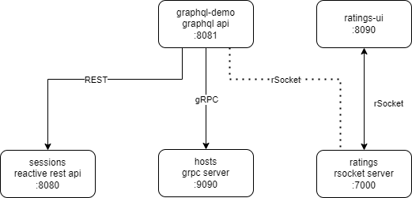

# DevLabs 9/06 Rest Alternatives demo

This is a demo project showing some alternatives to the REST protocol like GraphQL, gRPC and RSocket

## Architecture
Services including protocols and ports



## Requirements

- JDK17
- Maven (mvnw 3.8 wrapper included)
- GraphQl intellij plugin (recommended)

## Building
The `grpc-interface` project requires maven 3.8+ to build 
if you do not have this installed you van use the included maven wrapper.


Windows instructions
```
# If java home is not set
set JAVA_HOME=%JDK17_HOME_DIR%
# build using mvnw
mvnw.cmd clean install
```

Linux instructions
```
# Add execute privileges if necessary
chmod +x mvnw
# build using mvnw
./mvnw clean install
```